# Introduction

Vue.js + Firebase sample (VueFire + Vuex)

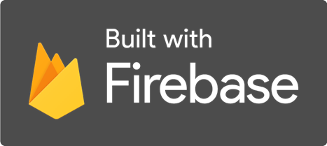


# Totorials

1. [VueFire – Firebase Auth and RTDB](https://karatejb.blogspot.com/2018/12/vue-vuefire-firebase-auth-and-rtdb.html)
2. [VueFire – CRUD on RTDB](https://karatejb.blogspot.com/2018/12/vue-vuefire-crud-on-rtdb.html)
3. [Vuex – basis](https://karatejb.blogspot.com/2018/12/vue-vuex-basis.html)
4. [Vuex – advanced](https://karatejb.blogspot.com/2018/12/vue-vuex-advanced.html)
5. [Shopcart example with VueFire and Vuex](https://karatejb.blogspot.com/2018/12/vue-shopcart-example-with-vuefire-and.html)
6. [Shopcart example with Firebase Cloud Messaging and Functions (1)](http://karatejb.blogspot.com/2018/12/vue-shopcart-example-with-firebase.html)
7. [Shopcart example with Firebase Cloud Messaging and Functions (2)](https://karatejb.blogspot.com/2018/12/vue-shopcart-example-with-firebase_8.html)
8. [Shopcart example with Firebase Cloud Messaging and Functions (3)](https://karatejb.blogspot.com/2018/12/vue-shopcart-example-with-firebase_11.html)


# Environment

- Vue.js 2.5.11
- Vue CLI 3.2.1
- Firebase Javascript SDK 5.5.8
- VueFire 1.4.5
- Vuex 3.0.01

# Features

### Firebase Authentication with Google Account

The user can login with google accounts.

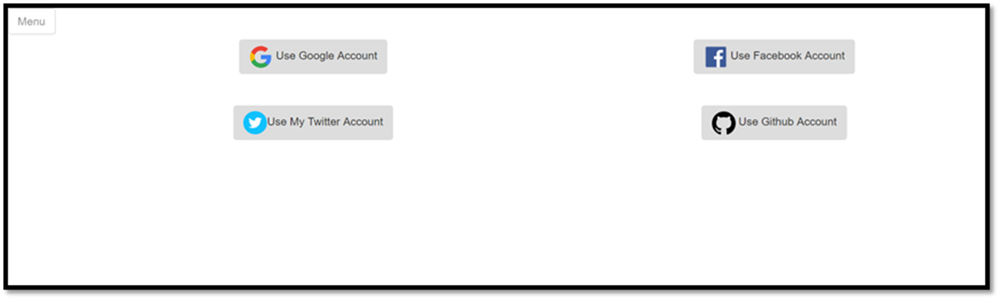


### State management

Use Vuex to manage the amount and cost when user put the product(s) to the shopping cart.

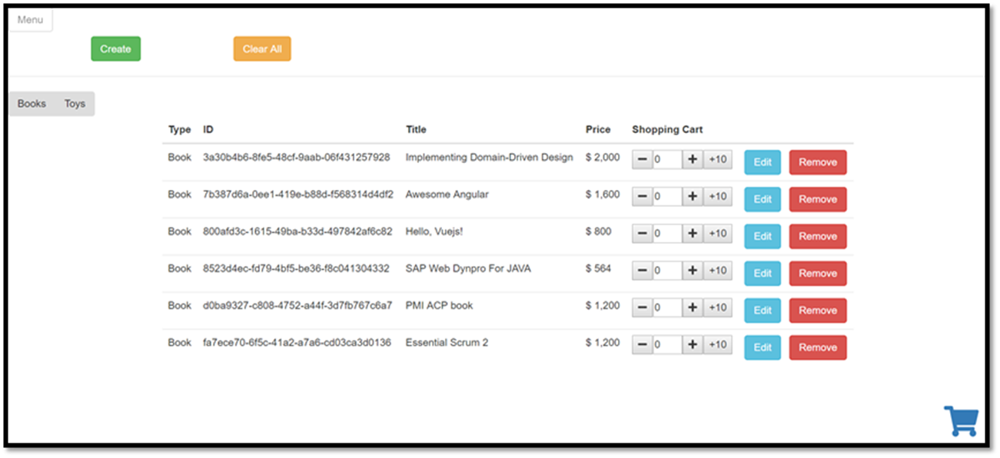


When click on the Shopping cart icon, the app will shows the items in the shopping cart.

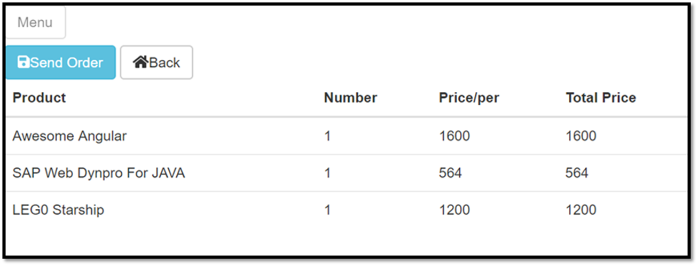


Send Order will save the order into [Firebase RTDB](https://firebase.google.com/docs/database/).


### Product management (Only for Admin in default)

Admin can create/edit/delete the products.
Drag or select a picture of the product to save it to [Firebase Cloud Storage](https://firebase.google.com/docs/storage/).

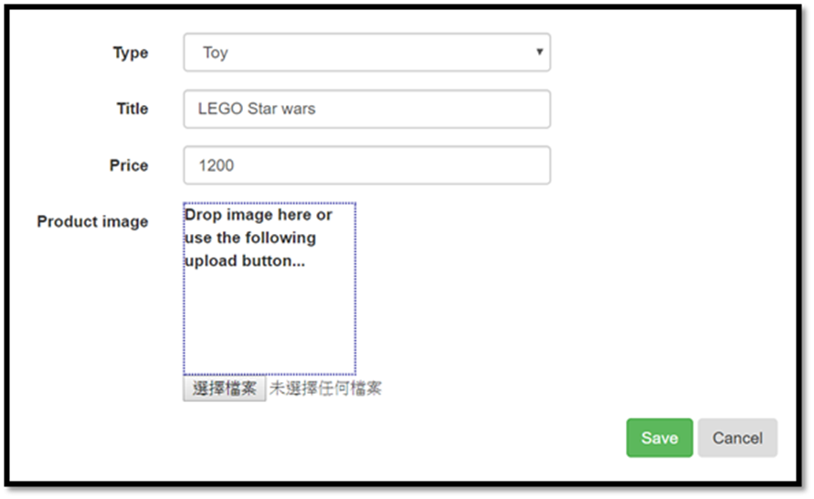


### Messaging by FCM

Supports FCM([Firebase Cloud Messaging](https://firebase.google.com/docs/cloud-messaging/)) for real-time message from [Cloud Functions](https://firebase.google.com/docs/functions/).

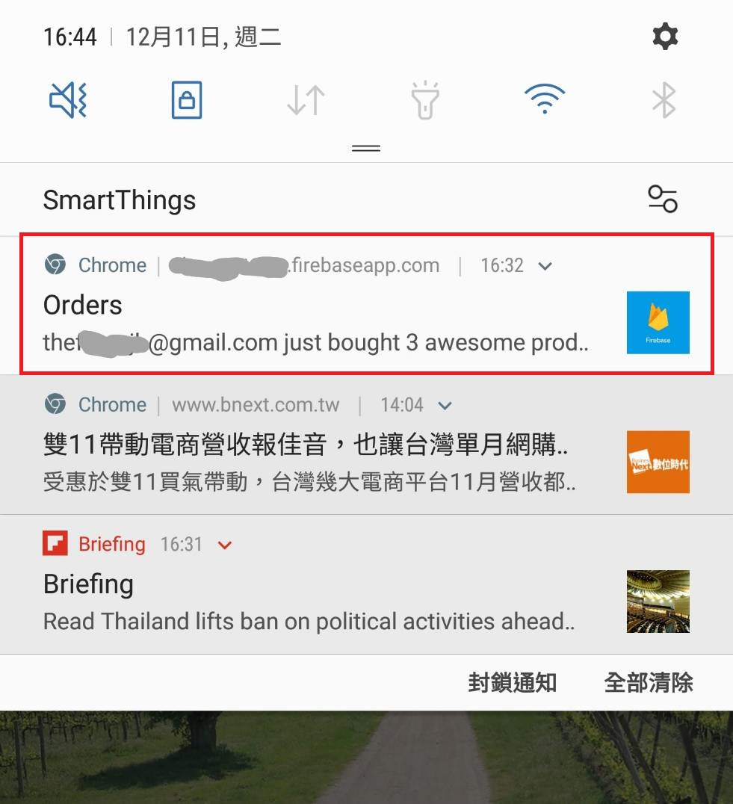


# Get started

## Firebase

### Create a new Firebase project

Go to [https://console.firebase.google.com/](https://console.firebase.google.com/)
and create a new project.

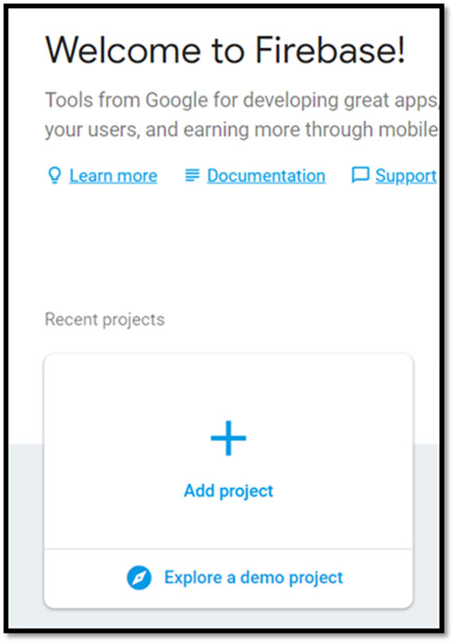


Notice that we will use the following features of Firebase.

1. Authentication
2. Real-time database
3. Cloud storage
4. Hosting

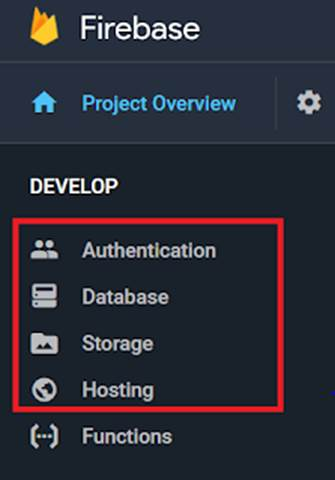


### Enable Google login

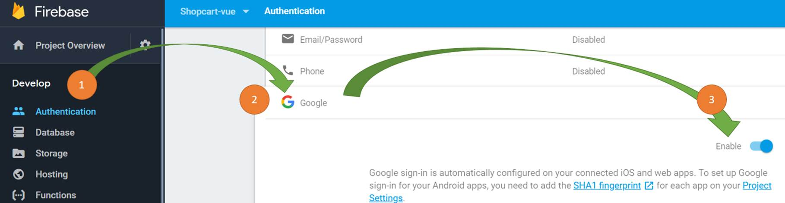


### Set RTDB rules

Copy the following rules to [RTDB rules](https://firebase.google.com/docs/database/security/).

```json
{
  "rules": {
    "Demo": {
      "products": {
        ".read": "auth != null",
        ".write": "auth != null  && auth.token.email == '<ur-email@gmail.com>'"
      },
      "orders": {
        ".read": "auth != null",
        ".write": "auth != null"
      }
    }
  }
}
```

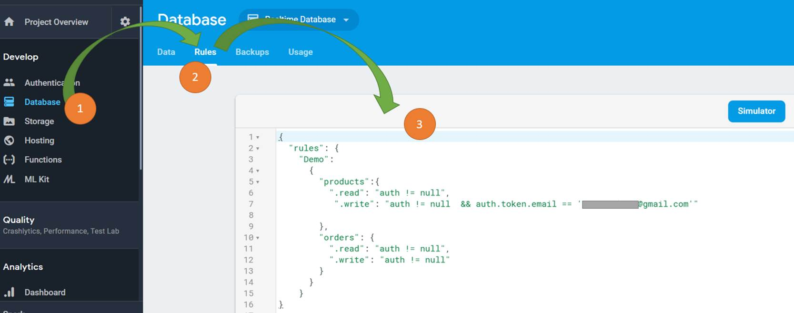


### Set Storage rules

Copy the following rules to [Storage rules](https://firebase.google.com/docs/storage/security/start).

```
service firebase.storage {
  match /b/{bucket}/o {
    match /{allPaths=**} {
      allow read: if request.auth!=null;
      allow write: if (request.resource.size < 1 * 1024 * 1024 && request.auth.token.email == '<ur-email@gmail.com>');
    }
  }
}
```

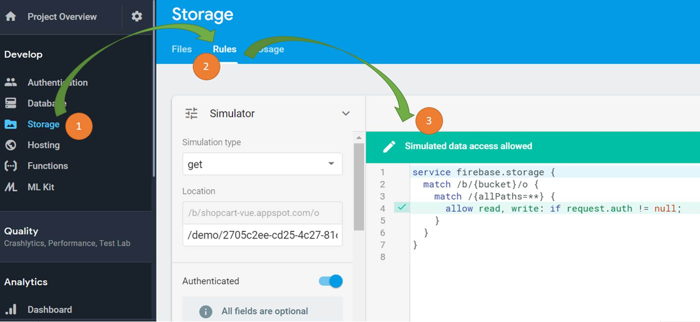


## Initialize the application


### Install dependencies

After you fork/clone the [Github repository](https://github.com/KarateJB/Vue.Firebase.Sample), install the dependencies by

```
$ cd app
$ npm install
```


## Update FirebaseConfig.ts

Back to Firebase, and copy the Firebase api config.

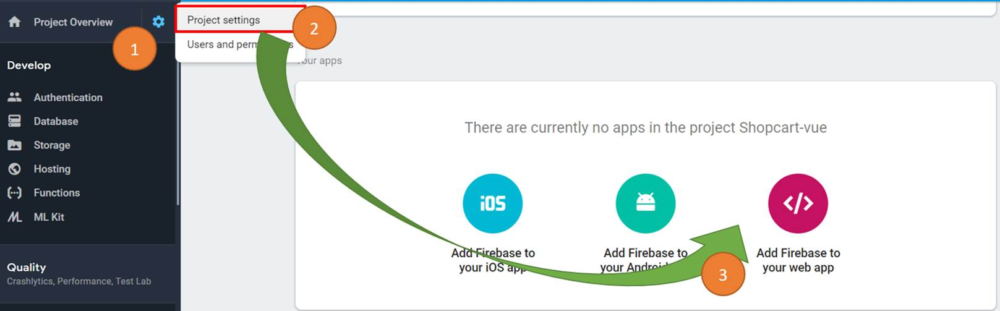

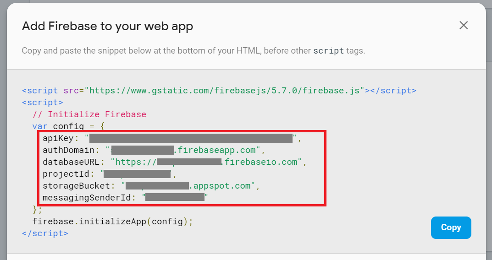

 
Rename `app\src\modules\FirebaseConfig.ts` to `FirebaseConfig.prod.js` and paste the above configuration to it.


## Deploy

### Build the app (To /dist)

```
$ npm run build
```

> Notice that I use [copy-webpack-plugin](https://github.com/webpack-contrib/copy-webpack-plugin) to copy the index.html to `dist` directory in `webpack.config.prod.js`.


▋Deploy to Firebase Hosting

Use Firebase CLI to deploy our application. Before deploying, we need to initialize the metadata by…

```
$ firebase login
$ firebase init
```

The first command will guide you to login a Google account.
The second command will guide you to initialize your application, you can take a look at my previous article: [[Angular] Deploy to Firebase](http://karatejb.blogspot.tw/2017/01/angular2-deploy-to-firebase.html) for more details.
(Dont worry, the steps for deploy Angular or Vue app to Firebase are the same)


After initializing, now you can deploy the application to Firebase with this command.

```
$ firebase deploy --only hosting
```


## Use other firebase project (Optional)

If we are going to manage multiple Firebase project in a single application, use the following command to ADD another Firebase project’s information.

```
$ firebase use --add
```

Check all Firebase projects in this application.

```
$ firebase list
```

Or switch to the other one.

```
$ firebase use {alias name}
```


---

> Have fun and if there are any questions, you can create an issue on [Github](C:\Users\ppipp\Documents\JB\Blogs\KarateJB\Vue.Firebase.Sample).


<br />
<br />
<br />


# License

Copyright 2018 KarateJB

Permission is hereby granted, free of charge, to any person obtaining a copy of this software and associated documentation files (the "Software"), to deal in the Software without restriction, including without limitation the rights to use, copy, modify, merge, publish, distribute, sublicense, and/or sell copies of the Software, and to permit persons to whom the Software is furnished to do so, subject to the following conditions:

The above copyright notice and this permission notice shall be included in all copies or substantial portions of the Software.

THE SOFTWARE IS PROVIDED "AS IS", WITHOUT WARRANTY OF ANY KIND, EXPRESS OR IMPLIED, INCLUDING BUT NOT LIMITED TO THE WARRANTIES OF MERCHANTABILITY, FITNESS FOR A PARTICULAR PURPOSE AND NONINFRINGEMENT. IN NO EVENT SHALL THE AUTHORS OR COPYRIGHT HOLDERS BE LIABLE FOR ANY CLAIM, DAMAGES OR OTHER LIABILITY, WHETHER IN AN ACTION OF CONTRACT, TORT OR OTHERWISE, ARISING FROM, OUT OF OR IN CONNECTION WITH THE SOFTWARE OR THE USE OR OTHER DEALINGS IN THE SOFTWARE.
